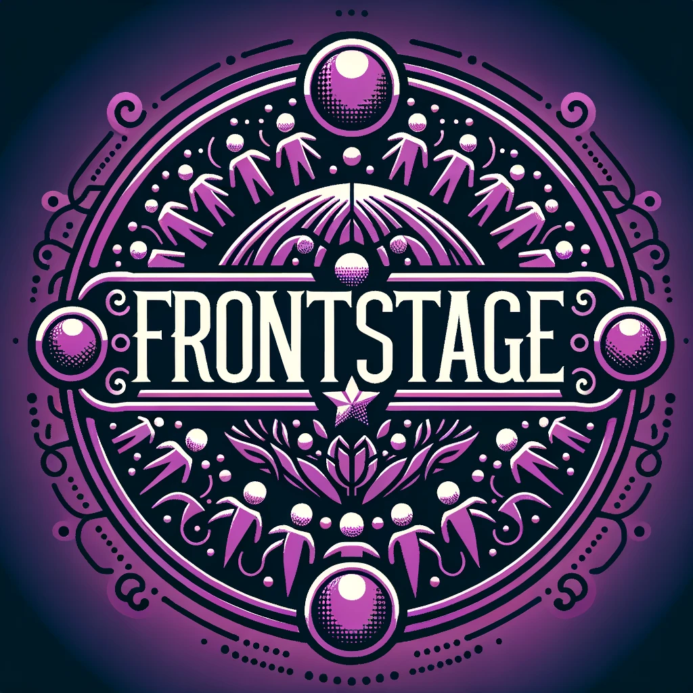

# Frontstage

Frontstage serves as a foundational layer for your self-hosted web services, making it easier to self-host develop and host web based applications.

> [!WARNING]  
> WIP: First release is pending.



Think of it as a more streamlined and opinionated alternative to running [Nginx](https://www.nginx.com) or [Apache](https://httpd.apache.org) on your server. It offers many of the same features and more with simple configuration:

1. Web Traffic:

   - **Web Server:** Frontstage handles to all incoming web traffic and routes them internally to your applications running on the same server or on your local network. It can also host your static web content directly.

   - **HTTPS Termination:** HTTPS traffic is handled entirely by Frontstage, so your application do not need to worry about security in transport.

   - **Reverse Routing:** Incoming requests is handled by requested hostname, so if you have multiple domain names direct to the same server, you can route them to different running applications.

2. Domain and Certifications:

   - **ACME Client:** Frontstage manages the certification process for all encrypted web traffic, like HTTPS, by either generating self-signed certificates or requesting them from [Lets Encrypt](https://letsencrypt.org). Renewals are handled automatically.

   - **Network status verification:** Domains configured in Frontstage are verified to be reachable to make debugging any network issues easier.

   - **Dynamic DNS:** If you are using [Digital Ocean](https://www.digitalocean.com) as your nameserver provider Frontstage can automatically re-route the domains you configure so that they point to your server. This is very usable in a home-server situation that can often change public IP adress.

3. Daemonization:

   - **Background process manager:** Replaces [Systemd](https://en.wikipedia.org/wiki/Systemd) and similar systems and handles the running, logging and automatic restarting of your self-hosted services if they should crash.

4. Other features:

- **Easy configuration:** All configuration is made in a single yaml file, which make it easy to overview what processes are running, which ports are used and domain names should be routed where. Frontstage verifies this file for you making mistakes nearly impossible.

- **Easy to understand runtime:** The CLI interface provide many queries as to understand what both Frontstage and your hosted applications are doing, to make both management and debugging easier. The complete state of Frontstage is stored in a easily readable Sqlite database, that is automaticly backed up for you to prevent dataloss.

- **Easy to understand source:** The source code is well documented and (tries) to follow a clear design structure based on configuration-to-operation-to-state.

## Background:

The goal of Frontstage is making it easy to self-host any web application without needing to learn or remember a complex underlying tech stack. The design-thinking is that it should handle everything that is immediately outside the actual scope of the application, and will probably be expanded in the future with support for logging, alterts,

It is built in a way that it should be as portable as possible, as to be able to run on any machine. It's specifically tested on virtual linux servers Raspberry Pi and MacOS.

It should be suitable if you want to run a small to medium self-hosted web stack. I use it personally for several web sites, my smart-home stack and also for some web-applications that sees minor to medium traffic load. If you are building a bigger web application that are expecting a huge amounts of traffic, you probably want something more scalable and battle-tested like ngnix.

The name _Frontstage_ refers to actions or performances that are meant for public view. Like, when you're around people and you're putting on a certain behavior 'cause you know you're being watched. It's a concept from sociology, where they talk about how people act differently when they're in public versus private. So, frontstage is basically the "public face" you put on.

## Getting started

**Security sssumptions:**
Your server should exist and be reachable, although Frontstage will verify this for you. It's recommended that you configure a suitable _user account_ for running Frontstage and set up a firewall anywhere on your network to limit unwanted access.

**Installation**

```sh
# install required software
apk add nodejs npm # or similar, see: https://nodejs.org/en/download/package-manager
npm install --global pm2
pm2 startup
# ...and follow any the instructions

# install frontstage
git clone git@github.com:lyret/frontstage.git
cd frontstage
npm clean-install
cp .defaults.env .env
nano .env
# ...and configure your environment
npx manager build

# optional: ensure the process manager starts on boot + verify installation
sudo reboot
npx manager verify
# Done!
```
